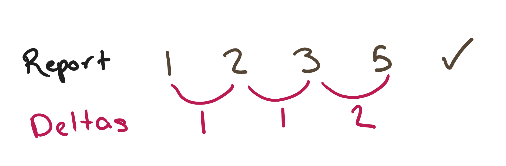
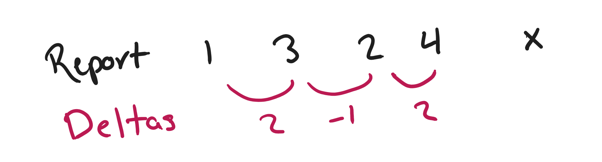
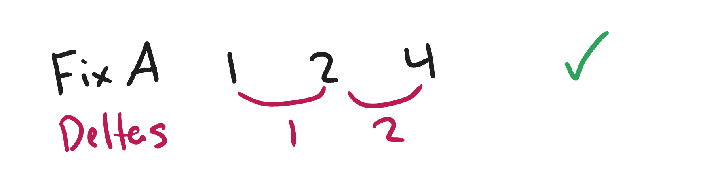
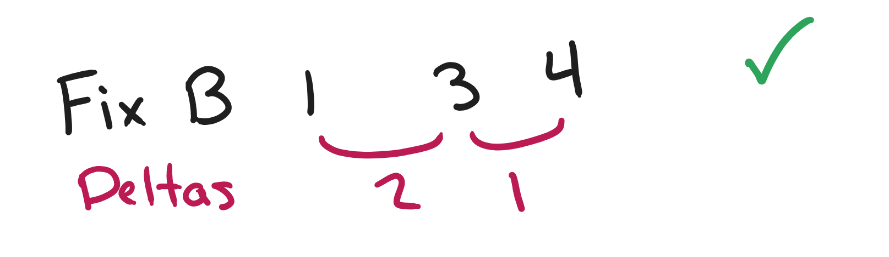
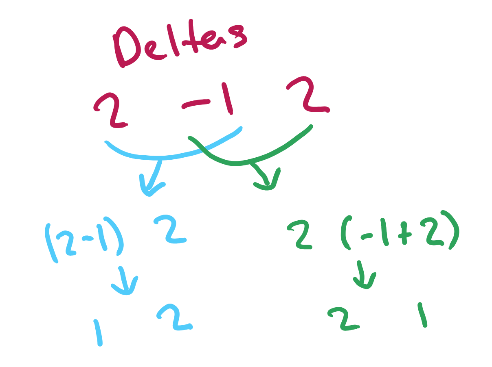

# Advent of Code 2024 Day 2

[Solution](index.js)

[Language: JavaScript] 1177/4982

---

## Table of Contents

1. [Input](#input)
1. [Part 1](#part-1)
    1. [Approaches](#approaches)
    2. [Solution](#solution)
1. [Part 2](#part-2)
    1. [Approaches](#approaches-1)
    2. [Solution](#solution-1)

---

## Input

Today's input consists of lists of integers. Parsing these proved very simple:

```js
const lines = input.split('\n');
const reports = [];
for (let i = 0; i < lines.length; ++i) {
	const levels = lines[i].split(' ');
	// the levels are currently strings ('5', '-2', etc); convert to numbers
	for (let n = 0; n < levels.length; ++n) {
		levels[n] = Number(levels[n]);
	}
	reports.push(levels);
}
```

or more concisely

```js
const reports = input.split('\n').map((line) => line.split(' ').map(Number));
```

---

## Part 1

The goal of part one is to find out how many of these reports pass a set of criteria:

-   The levels are either **all increasing** or **all decreasing**.
-   Any two adjacent levels differ by **at least one** and at **most three**.

### Solution

The main solution is to iterate over the list and check to see if it satisfies the constraints. First, we'll want to make each report be increasing so we can avoid writing additional logic for reports that are decreasing. We can do this by checking if it is decreasing, and then reversing the array.

Once we've done that, we just need to check to make sure that each pair is increasing and that the distance between them is within the valid bounds.

```js
let count = 0;
for (let report of reports) {
	// if the first item is bigger than the last, it must be decreasing
	if (report[0] > report.at(-1)) {
		// reverse it so all reports are increasing
		report.reverse();
	}

	let safe = true;
	// end at report.length - 1 since we're taking pairs
	for (let r = 0; r < report.length - 1; ++r) {
		const a = report[r];
		const b = report[r - 1];
		const distance = b - a;
		// check to make sure they're increasing and the distance is correct
		if (b < a || distance < 1 || distance > 3) {
			// if not, mark as safe and break from the loop
			safe = false;
			break;
		}
	}

	if (safe) {
		++count;
	}
}
```

When you think about the math, `b < a` and `distance < 1` are essentially the same check - if `distance` (aka `b - a`) was less than `1`, there'd be no way that `b < a` is true. Due to this, we could change our conditional to either of the following:

1. `if (b < a || distance > 3)`
2. `if (distance < 1 || distance > 3)`

I prefer the second, since it makes more sense to someone reading the code later (whether it be someone else or myself).

---

## Part 2

The twist in part 2 is that reports are allowed to have one bad level in them.

> Now, the same rules apply as before, except if removing a single level from an unsafe report would make it safe, the report instead counts as safe.

Thank you for the hint, Eric!

### Solution

My first approach to solving this was to try to use some clever math, but I wasn't able to figure it out at first. I'll cover that later.

What many people did, including myself, is take the little hint from Eric about removing a single level. We can loop over each item in the array, remove it, and see if that generates a valid solution!

Let's modify our part 1 solution a bit to get it primed for our addition. We'll pull out the validation check into its own function:

```js
function checkIfSafe(report) {
	for (let r = 0; r < report.length - 1; ++r) {
		const a = report[r];
		const b = report[r - 1];
		const distance = b - a;
		if (b < a || distance < 1 || distance > 3) {
			return false;
		}
	}
	return true;
}

let count = 0;
for (let report of reports) {
	if (report[0] > report.at(-1)) {
		report.reverse();
	}

	let safe = checkIfSafe(report);

	// [ we'll write more code here in a moment ]

	if (safe) {
		++count;
	}
}
```

From here, we'll modify the lower for loop to check with each level pulled out one by one. To achieve this, we'll be using a variant of `.splice()` ([docs](https://developer.mozilla.org/en-US/docs/Web/JavaScript/Reference/Global_Objects/Array/splice)) called `.toSpliced()` ([docs](https://developer.mozilla.org/en-US/docs/Web/JavaScript/Reference/Global_Objects/Array/toSpliced)), which takes in an index to remove items from and a length as its arguments.

```js
	// ...
	let safe = checkIfSafe(report);

	// if it's not safe, then we need to do further checking
	if (!safe) {
		for (let i = 0; i < report.length; ++i) {
			// get a copy of the report with one item removed
			const modifiedReport = report.toSpliced(i, 1);
			// if the modified report is safe...
			if (checkIfSafe(modifiedReport)) {
				// then we're good! Mark it as safe and break out of the loop
				safe = true;
				break;
			}
		}
	}

	if (safe) {
	// ...
```

Viola! By checking each modified version, we can find which ones satisify the "one bad level" check in addition to the ones that normally pass.

#### Math Time!

I knew there had to be a clever way to see if a report can be made safe without having to create multiple different arrays. It turns out, there is!

The first step is to get the deltas (distances) between each value. You can see in the image below, a safe report has all positive deltas.



Unsafe reports, on the other hand, have at least one non-positive delta (either negative or `0`).



There's two different ways we can fix the report.

Either remove the `3`:



or the `2`:



Seeing that the deltas for the two fixes are `1 2` and `2 1`, I had a good inkling that we might be able to combine a non-positive delta with the delta before/after it.



Isn't that nice?

A few things we need to keep in mind here:

1. If there are multiple non-negative deltas, we can't fix it, so skip that report
2. Once we combine the deltas, we need to ensure that they validate the distance rule (`distance >= 1 && distance <= 3`)
3. Non-negative includes `0`!

Let's get coding!

#### Generating Deltas

We actually already generated deltas before, so this code should look familiar. Earlier, however, we called them distances. Delta (Δ) simply means the difference between two values.

```js
function getDeltas(report) {
	const deltas = [];
	// same as before, we stop at `report.length - 1` since we're picking pairs
	for (let r = 0; r < report.length - 1; ++r) {
		const a = report[r];
		const b = report[r - 1];
		deltas.push(b - a);
	}
	return deltas;
}
```

or more concisely

```js
function getDeltas(report) {
	// .slice(0, 1) since the last item will be `undefined`
	return report.map((v, i) => report[i + 1] - v).slice(0, -1);
}
```

#### Validating Deltas

We'll need to check if there are any non-positive deltas. When we find one, we'll store its index in an array, which we'll use to handle one of three cases. We also will define a `checkDeltas()` function that will sum two deltas and ensure that the new delta formed satisfies the distance requirement.

```js
let count = 0;
for (let report of reports) {
	const deltas = getDeltas(report);
	const checkDeltas = (a, b) => {
		const newDelta = deltas[a] + deltas[b];
		return newDelta >= 1 && newDelta <= 3;
	};

	const errorDeltas = [];
	for (let i = 0; i < deltas.length; ++i) {
		// if the current delta is non-positive...
		if (deltas[i] <= 0) {
			// ...store its index
			errorDeltas.push(i);
		}
	}

	let safe = false;
	if (errorDeltas.length === 0) {
		// [ see below ]
	} else if (errorDeltas.length === 1) {
		// [ see below ]
	} else if (errorDeltas.length === 2) {
		// [ see below ]
	}

	if (safe) {
		++count;
	}
}
```

The simplest case is no errors at all, where we can simply just increment the counter:

```js
if (errorDeltas.length === 0) {
	// if there are no errors, we're good!
	safe = true;
} else if (errorDeltas.length === 1) {
```

If we have a single error delta, we can combine it with its left neighbor or right neighbor to see if they form a new, valid delta. If it's the first or last item, then we know it can be fixed by removing that single item:

```js
 else if (errorDeltas.length === 1) {
	const deltaIndex = errorDeltas[0];

	// check if the error delta is the first or last delta
	if (deltaIndex === 0 || deltaIndex === deltas.length - 1) {
		safe = true;
	}

	// check if there's a value to the left to combine the delta with
	if (deltaIndex > 0 && checkDeltas(deltaIndex - 1, deltaIndex)) {
		safe = true;
	}

	// check if there's a value to the right to combine the delta with
	if (deltaIndex < deltas.length - 1 && checkDeltas(deltaIndex, deltaIndex + 1)) {
		safe = true;
	}
} else if (errorDeltas.length === 2) {
```

The last case we check is if there are two error deltas. This case can only be safe if the two deltas are either the first two or last two deltas in the list, in addition to satisfying the `checkDeltas()` check.

```js
} else if (errorDeltas.length === 2) {
	const a = errorDeltas[0];
	const b = errorDeltas[1];
	// if the two error deltas satisfy the distance requirement...
	if (checkDeltas(a, b)) {
		// ...check if they are the first two or last two deltas
		if (a === 0 && b === 1) {
			safe = true;
		} else if (a === deltas.length - 2 && b === deltas.length - 1) {
			safe = true;
		}
	}
}
```

The `count` variable should now house the correct number of reports that can be made safe!
